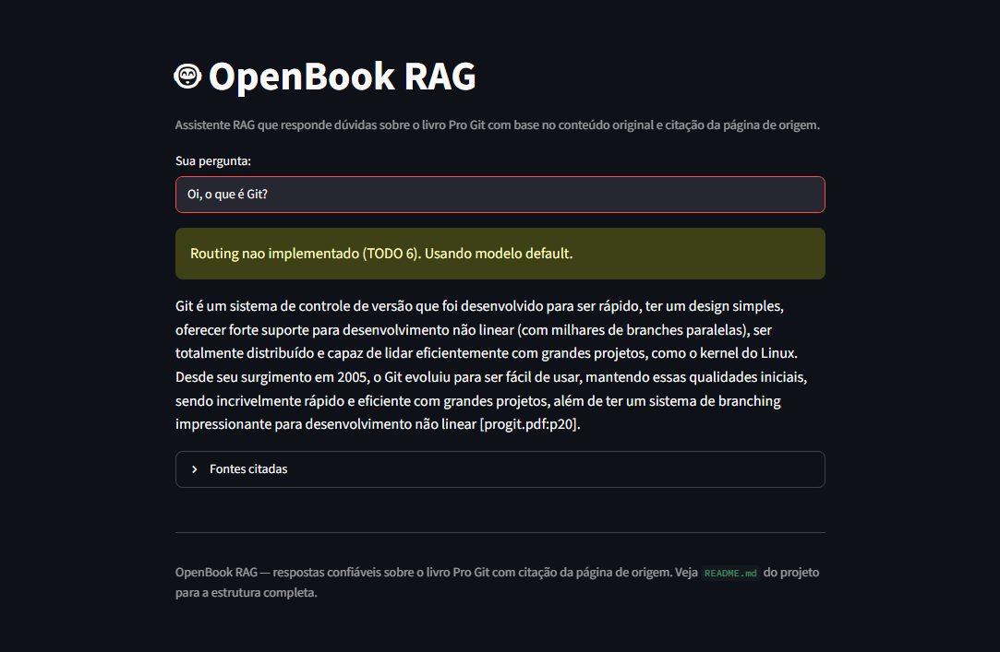
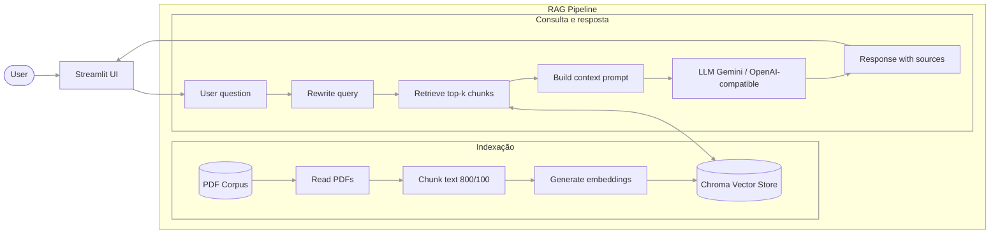

# OpenBook RAG

> O **OpenBook RAG** é um assistente para estudantes e desenvolvedores que responde dúvidas sobre o livro técnico open-source **Pro Git**, utilizando RAG para recuperar trechos relevantes e citar a página de origem.


<!-- TODO: cole aqui o GIF de demo (10-15s, <5MB) gerado com peek/terminalizer/OBS -->
<p align="center">
  
</p>

**Live demo:** [OpenBook RAG no Streamlit Cloud](https://openbook-rag.streamlit.app/)

## Problem statement

1. Qual problema voce resolve? 
> O OpenBook RAG resolve o problema de encontrar, de forma rápida e confiável, respostas específicas dentro de um livro técnico extenso, sem que o usuário precise procurar manualmente no PDF inteiro ou depender de respostas genéricas da internet
2. Para quem? 
> O projeto é voltado para estudantes, desenvolvedores e pessoas que estão aprendendo Git.
3. Por que LLM + RAG + Tool-use eh a abordagem certa (vs. busca simples)?
> LLM + RAG + Tool-use permite responder em linguagem natural, recuperar trechos relevantes e citar páginas, melhor que uma busca simples.

## Perguntas representativas

- O que é um branch no Git?
- Como funciona um merge e quando podem ocorrer conflitos?
- Qual a diferença entre `git pull` e `git fetch`?

## Arquitetura



O RAG Pipeline é responsável por transformar o livro *Pro Git* em uma base consultável. Para isso, o PDF é lido, dividido em chunks de `800` caracteres com `100` de sobreposição, convertido em embeddings e armazenado no Chroma.

A partir da pergunta do usuário, o sistema recupera os trechos mais relevantes, monta um prompt com esse contexto e envia ao LLM configurado. A resposta final é gerada com base no conteúdo recuperado e apresenta as fontes utilizadas, incluindo arquivo e página. O projeto também registra logs estruturados com `trace_id`, eventos e latência para observabilidade básica.

## Avaliação RAGAS

A qualidade do pipeline RAG foi avaliada com um golden set de perguntas sobre diferentes capítulos do livro *Pro Git*.

| Métrica | Média |
|---|---:|
| Faithfulness | 0.96 |
| Answer relevancy | 0.90 |
| Context precision | 0.96 |

Os resultados indicam boa fidelidade das respostas ao contexto recuperado, alta relevância em relação às perguntas e boa precisão na recuperação dos trechos usados como fonte.

## Setup

```bash
# 1. Clone (se nao clonou ainda)
git clone https://github.com/janasoliv/openbook-rag.git
cd openbook-rag

# 2. Dependencias
uv venv && source .venv/bin/activate
uv sync

# 3. API key (escolha 1 provider em .env.example)
cp .env.example .env
# edite .env com sua key

# 4. Corpus
# Substitua data/corpus/*.pdf pelos seus documentos
# OU copie dos papers do M2:
# cp ../../../datasets/corpus/*.pdf data/corpus/

# 5. Rodar local
streamlit run src/ui/streamlit_app.py
```

<!-- ## Cost & Latency

TODO — preencher apos rodar bench de 50 queries (veja notebook 05).

| Estrategia | Custo total | Reducao | P95 latency |
|---|---:|---:|---:|
| Baseline (premium sempre) | $X.XX | — | XX ms |
| + Exact cache | $X.XX | XX% | XX ms |
| + Semantic cache | $X.XX | XX% | XX ms |
| **+ Routing cheap-first** | **$X.XX** | **XX%** | **XX ms** |

Meta da rubrica (banda "excelente"): **≥50% de reducao** + P95 reportado. -->

## Design decisions

TODO — 3-5 bullets explicando decisoes NAO obvias:

- Por que escolhi este embedding model? 
> Escolhi text-embedding-3-small porque ele equilibra bem custo, qualidade e simplicidade operacional. O corpus é pequeno e fixo, composto pelo livro Pro Git, então não há necessidade de um embedding maior e mais caro. Como o conteúdo técnico tem muitos termos em inglês, especialmente comandos e conceitos de Git, esse modelo atende bem ao idioma dominante do corpus e ainda funciona para perguntas em português, já que a pergunta é convertida em embedding e comparada semanticamente com os trechos indexados.

- Por que `chunk_size` = X? 
> O projeto usa chunk_size=800 com chunk_overlap=100. Esse tamanho foi escolhido porque preserva contexto suficiente para explicar conceitos técnicos, como branch, merge, rebase e comandos relacionados, sem gerar chunks grandes demais que misturem vários assuntos. Valores menores tenderiam a fragmentar explicações e perder contexto; valores maiores poderiam trazer ruído e reduzir a precisão do trecho recuperado. O overlap de 100 ajuda a não cortar ideias importantes entre chunks consecutivos.

- Por que esta tool especifica?
> A tool implementada é lookup_chapter(chapter). O problema que ela resolve é a navegação por estrutura do livro: quando o usuário pergunta sobre um capítulo específico ou quer localizar onde um tema aparece, uma busca vetorial pura poderia até encontrar trechos relevantes, mas não necessariamente daria uma visão clara da organização do livro. Escolhi essa tool porque o domínio é um livro técnico com capítulos bem definidos; então um lookup direto por capítulo é simples, barato, determinístico e útil para orientar a recuperação no corpus. Ela complementa o RAG, mas a resposta final ainda deve usar o corpus indexado para citar páginas.

- Por que NAO incluo re-ranking?
> Não incluí re-ranking porque o corpus é pequeno e fixo, baseado em um único PDF do Pro Git. A recuperação top-k no Chroma, com embeddings e k=5, já é suficiente para o escopo atual. Um re-ranker adicionaria uma segunda etapa de inferência, aumentando latência e possivelmente custo, sem ganho proporcional para esse tamanho de corpus. Como a aplicação é uma demo interativa em Streamlit, a latência de resposta é mais crítica do que espremer uma pequena melhora de precisão.


## Limitations

TODO — 3 bullets honestos:

- **Limitacao 1**: O corpus é fixo e atualmente baseado apenas no PDF progit.pdf. A aplicação funciona bem para dúvidas sobre o livro Pro Git, mas não responde corretamente sobre conteúdos fora desse material.

- **Limitacao 2**: A recuperação usa busca vetorial top-k simples no Chroma, sem re-ranking. Isso reduz latência e mantém o projeto simples, mas pode trazer trechos menos precisos em perguntas muito ambíguas ou quando vários capítulos tratam de temas parecidos.

- **Limitacao 3**: A demo não suporta upload de PDFs pelo usuário. Para trocar ou ampliar o corpus, é necessário adicionar os arquivos em data/corpus e reconstruir o índice local em data/chroma.

## Tech stack

- **LLM:** GPT-4o-mini (alt)
- **Embeddings:** text-embedding-3-small
- **Vector store:** Chroma local
- **UI:** Streamlit
- **Observability:** structured logs com trace_id (Langfuse opcional)
- **Deploy:** Streamlit Community Cloud

## Estrutura

```
openbook-rag/
├── data/
│   ├── corpus/           # PDF Pro Git (substituir os de exemplo)
│   └── chroma/           # vector store (gitignored)
├── src/
│   ├── ui/streamlit_app.py
│   ├── pipeline/
│   │   ├── rag.py        # TODOs 1-3
│   │   ├── tools.py      # TODO 4
│   │   ├── cache.py      # TODO 5
│   │   └── routing.py    # TODO 6
│   └── observability/trace.py
├── tests/test_smoke.py
├── pyproject.toml
├── .env.example
└── README.md
```

## Os 6 TODOs (mapa rapido)

| TODO | Arquivo | Tempo estimado | Material de referencia |
|---|---|---:|---|
| **1** | `src/pipeline/rag.py::ingest_and_index` | 20 min | notebook 02 Etapas 1+2+3 |
| **2** | `src/pipeline/rag.py::retrieve` | 5 min | notebook 02 Etapa 4 |
| **3** | `src/pipeline/rag.py::answer` | 15 min | notebook 02 Etapa 5 |
| **4** | `src/pipeline/tools.py` (sua tool) | 30 min | LAB-001 + criatividade |
| **5** | `src/pipeline/cache.py::SemanticCache.get` | 15 min | notebook 05 Etapa 4 |
| **6** | `src/pipeline/routing.py::classify_complexity` | 10 min | notebook 05 Etapa 5 |

**Total estimado:** ~1h35 dos 6 TODOs. Resto do tempo: corpus, deploy, README, polish.

## Rubrica

Veja `projeto-portfolio.pdf` (briefing do projeto) para a rubrica 3-bandas completa.

| Critério | Peso | Sua entrega |
|---|:-:|---|
| Técnica | 40% | TODOs 1-6 funcionando + erros tratados + logs |
| README | 30% | Este arquivo preenchido (incluindo GIF + decisoes + limites) |
| Custo | 20% | Tabela acima preenchida + reducao ≥50% (opcional) |
| Demo | 10% | URL publica acessivel sem crash |

---

*Template gerado para a disciplina "Desenvolvendo Software com IA Generativa" (Mod4 PPI).*
